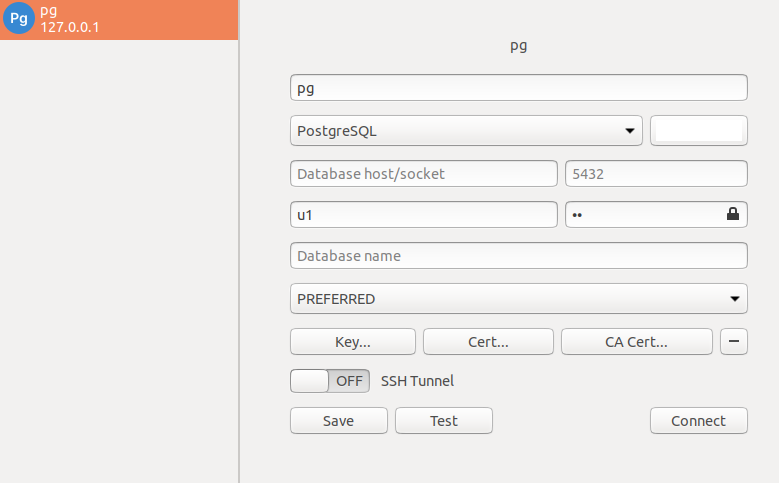
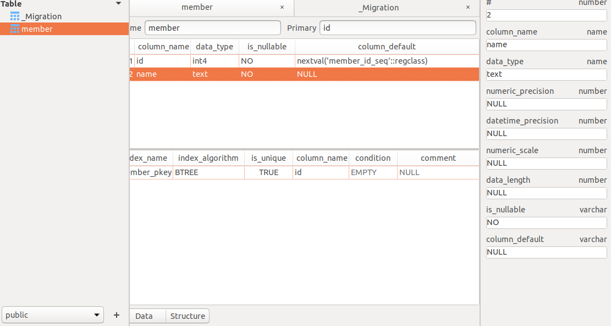

# test_prisma_pg
postgres with docker


## launch database

Edit docker-compose.yml to use postgres (choose whichever user/pwd you want)

```
version: '3.8'
services:
  postgres:
    image: postgres:13.0
    restart: always
    container_name: "prisma_pg_1"
    environment:
      - POSTGRES_USER=u1
      - POSTGRES_PASSWORD=p1
    volumes:
      - postgres:/var/lib/postgresql/data
    ports:
      - '5432:5432'
volumes:
  postgres:
```


Then launch the database: 

```
$ docker-compose up -d
Creating network "pgdocker_default" with the default driver
Creating prisma_pg_1 ... done
```


To check that it works, you may check the processes running on docker (using: docker ps) or try to connect to the postgres instance. For instance with tableplus or psql (requires psql -d "host=localhost port=5432 dbname=<dbname> user=u1")




## Using prisma 

Now let's try to use prisma, we first need to init our environment.

```
$ npx prisma init
```

Then edit prisma/schema.prisma (you may change the model part)

```
datasource db {
  provider = "postgresql"
  url      = "postgresql://u1:p1@localhost:5432/prisma?schema=public"
}

generator client {
  provider = "prisma-client-js"
}

model member {
  id        Int    @default(autoincrement()) @id
  name      String
}
```

Then run the prisma commands: 

```
$ npx prisma migrate save --experimental --create-db --name "init"
$ npx prisma migrate up --experimental
$ npx prisma generate
$ npx prisma studio
```


You may also connect using any postgres client. 




### Alternative with .env 

Define the following inside .env:
`DATABASE_URL=postgresql://u1:p1@localhost:5432/prisma?schema=public`

```
datasource db {
  provider = "postgresql"
  url      = env("DATABASE_URL")
}
```